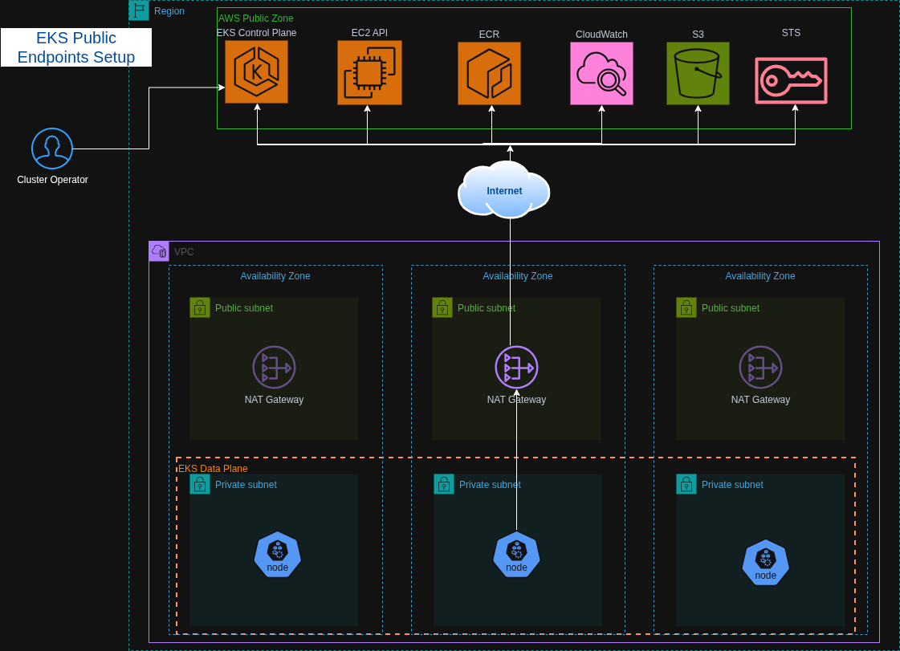
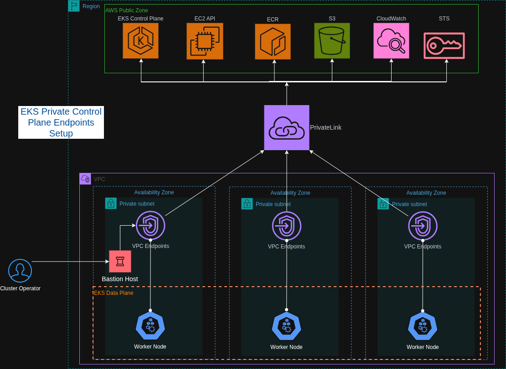

# Automated EKS cluster deployment

Terraform + GitHub Actions workflow for deploying EKS clusters.

Supports multiple environments (dev/staging/prod) and a choice of public or private control plane endpoint.

---

## Table of Contents

- [Architecture Overview](#architecture-overview)
- [Key Features](#key-features)
- [Project Structure](#project-structure)
- [Infrastructure Design](#infrastructure-design--awseks)
  - [Public Endpoint Mode](#public-endpoint-mode)
  - [Private Endpoint Mode](#private-endpoint-mode)
- [CI/CD Pipeline](#cicd-pipeline)
- [Project Structure](#project-structure)
- [Environment Management](#environment-management)
- [Prerequisites & Bootstrap](#prerequisites--bootstrap)
- [GitHub Actions Variables](#github-actions-variables)
- [Security Design](#security-design)
- [Design Decisions](#design-decisions)

---

## Architecture Overview

```
GitHub Actions (OIDC)
        │
        └── AWS ──► Terraform ──► VPC + EKS Cluster
                                    ├── Public endpoint (NAT GW, IGW)
                                    └── Private endpoint (Bastion + EICE + VPC Endpoints)
```

The workflow supports **deploy**, **destroy**, and **test-only** actions across multiple isolated environments (`dev-01`, `dev-02`, `prod-01`, etc.). Each environment is fully self-contained with its own VPC, cluster, and Terraform state file.

## Run workflow demo

<video src="https://github.com/user-attachments/assets/0bde3f01-a2b3-4cc4-b43a-92db4bf78924" controls width="100%"></video>

---

## Key Features

- **Zero standing credentials:** GitHub Actions authenticates to AWS via OIDC — no IAM access keys ever stored as secrets
- **Dual endpoint modes:** Supports both public and fully air-gapped private EKS clusters, selectable at deploy time
- **Private cluster access:** Keyless SSH tunnel through an EC2 Instance Connect Endpoint (EICE) and ephemeral bastion host — no open inbound ports, no stored SSH keys
- **Multi-environment:** Isolated clusters per environment (dev-01, dev-02, prod-01, …) with per-environment `.tfvars` files and separate remote state paths
- **Least-privilege IAM:** Custom IAM policy (`LeastPriviliges.json`) built using `iamlive` + Access Analyzer, granting only the permissions Terraform actually requires
- **VPC-CNI Prefix Delegation:** Increases pod density per node and accelerates IP assignment — relevant for cost-efficient small instance types like `t3.small`
- **Cluster connectivity testing:** Automated post-deploy or standalone test job validates EKS node and pod readiness, adapting transparently to public or private tunnel mode

---

## Infrastructure Design

### Public Endpoint Mode

The cluster API server is reachable over the public internet (protected by IAM and Kubernetes RBAC). The VPC is provisioned with an Internet Gateway and a NAT Gateway, enabling worker nodes to pull images from ECR and reach AWS APIs.



**VPC layout:**
- Public subnets: one per requested AZ, used by the NAT Gateway
- Private subnets: worker nodes are always placed here — never directly exposed

### Private Endpoint Mode

The cluster API server has no public endpoint. All traffic stays inside the VPC. This mode provisions additional resources:

| Resource | Purpose |
|---|---|
| EC2 Instance Connect Endpoint (EICE) | Enables keyless SSH access into the VPC — no bastion public IP, no open security group rules |
| Bastion EC2 (`t3.nano`) | Jump host in a private subnet, reached exclusively via EICE |
| VPC Interface Endpoints | ECR API, ECR DKR, STS, EC2, EKS, CloudWatch Logs — keep all AWS API traffic off the public internet |
| S3 Gateway Endpoint | Cost-free path for ECR image layer pulls from S3 |



**Private cluster connectivity test flow:**
1. GitHub Actions authenticates to AWS via OIDC
2. The bastion instance ID is resolved by tag name
3. An ephemeral `ed25519` key pair is generated in memory
4. The public key is pushed to the bastion via `ec2-instance-connect send-ssh-public-key` (valid for 60 seconds)
5. An SSH tunnel is established: `localhost:6443 → bastion → EKS private endpoint`, proxied through EICE
6. `kubectl` commands run against `https://localhost:6443` with the tunnel active

---

## CI/CD Pipeline

**File:** `.github/workflows/deploy_multi_cluster.yaml`

The workflow is triggered manually (`workflow_dispatch`) with the following inputs:

| Input | Options | Description |
|---|---|---|
| `action` | `deploy`, `destroy`, `test-only` | Operation to perform |
| `cloud` | `AWS` | Target cloud provider |
| `env_type` | `dev`, `staging`, `prod` | Environment tier |
| `env_number` | `01`–`99` | Cluster number (zero-padded) |
| `endpoint_access` | `public`, `private` | AWS EKS API server exposure (AWS only) |

**Job graph:**

```
validate
   └── terraform-aws  (if action≠test-only)
           └── test-aws-cluster  (if action=deploy or test-only)
```

- The `test-aws-cluster` job runs even if `terraform-aws` was skipped (`always()` condition), enabling standalone cluster health checks without re-running Terraform.
- Terraform **Apply** and **Destroy** are gated to the `main` branch.
- Terraform state is stored in S3 at `{endpoint_access}/{env_type}/{env_number}/terraform.tfstate`.

---

## Environment Management

Each environment is defined by a `.tfvars` file under `aws/terraform/envs/`.

Sample files:


[dev-01.tfvars](./terraform/envs/dev-01.tfvars)   →  cluster: dev-01,  state key: public/dev/01/terraform.tfstate

[dev-02.tfvars](./terraform/envs/dev-02.tfvars)   →  cluster: dev-02,  state key: public/dev/02/terraform.tfstate

[prod-01.tfvars](./terraform/envs/prod-01.tfvars)  →  cluster: prod-01, state key: private/prod/01/terraform.tfstate

Naming convention: `{env_type}-{env_number}.tfvars` — the workflow enforces this by constructing the `-var-file` path from the workflow inputs.

**Before running the workflow you must configure an appropriate tfvars file, adhere to the naming convention and placing it in the `envs` directory.**

Settings in the `Run workflow` menu will overide tfvars files.

---

## Project Structure

```
.
├── .github/workflows/
│   └── deploy_multi_cluster.yaml   # Unified CI/CD pipeline
├── aws/
│   └── terraform/
│       ├── backend.tf              # S3 remote state backend
│       ├── eks.tf                  # EKS cluster + managed node group + addons
│       ├── vpc.tf                  # VPC, subnets, NAT gateway, IGW
│       ├── locals.tf               # Computed locals, AZ validation
│       ├── variables.tf            # All input variable definitions
│       ├── providers.tf            # AWS provider config
│       ├── envs/
│       │   ├── dev-01.tfvars       # Dev cluster 01 config
│       │   ├── dev-02.tfvars       # Dev cluster 02 config
│       │   └── prod-01.tfvars      # Production cluster config
│       ├── public/                 # Public endpoint overlay
│       │   ├── locals_public.tf
│       │   └── outputs.tf
│       └── private/                # Private endpoint overlay
│           ├── bastion.tf          # Bastion EC2, IAM role, security groups
│           ├── eice.tf             # EC2 Instance Connect Endpoint
│           ├── vpc_endpoints.tf    # Interface endpoints (ECR, STS, EC2, EKS, CWLogs)
│           └── outputs.tf
└── docs/
    ├── prerequisites.md
    ├── aws_public_endpoints_access.drawio.png
    └── aws_private_endpoints_access.drawio.png
```

---

## Prerequisites & Bootstrap

See [docs/prerequisites.md](docs/prerequisites.md) for the full one-time AWS account setup, including OIDC provider creation, IAM role and policy bootstrapping, and S3 state bucket creation.

---

## GitHub Actions Variables

Set the following as repository-level **Variables** (not secrets — values are non-sensitive; the OIDC role ARN is not a secret):

| Variable | Example Value |
|---|---|
| `AWS_ROLE_ARN` | `arn:aws:iam::123456789012:role/github-actions-eks-role` |
| `AWS_REGION` | `eu-west-1` |

---

## Security Design

| Concern | Approach |
|---|---|
| CI/CD credentials | OIDC — no long-lived AWS keys |
| Bastion SSH access | EC2 Instance Connect + ephemeral key (60-second window) — no stored private keys |
| Private cluster API | Zero inbound internet exposure; accessed only via SSH tunnel through EICE |
| IAM permissions | Custom least-privilege policy built with `iamlive` and validated with Access Analyzer |
| Terraform state | S3 backend with per-environment path isolation |
| Branch protection | Apply and Destroy steps are gated to `refs/heads/main` |

---

## Design Decisions

**Why EICE instead of SSM Session Manager for the bastion tunnel?**

EICE supports standard SSH port-forwarding (`-L`), which is required to redirect `kubectl` traffic from `localhost:6443` to the private EKS endpoint. SSM doesn't expose a raw TCP socket in the same way, making it unsuitable for this pattern.

**Why VPC-CNI Prefix Delegation?**

Without Prefix Delegation small instance types like `t3.small` support only a limited number of secondary IPs per ENI. Each pod consumes one of those IPs, which exhausts ip pool quickly. 

Prefix Delegation assigns a `/28` prefix (16 addresses) per ENI instead, increasing pod capacity to 110 and reducing IP assignment latency on pod startup.

**Why a 60-second `time_sleep` before CoreDNS and metrics-server?**

Prefix Delegation takes time to propagate after the VPC-CNI addon is active. Without the delay, CoreDNS and metrics-server pods can be scheduled before warm IP addresses are available, causing startup failures.

**Why separate `public/` and `private/` Terraform directories?**

The private endpoint configuration requires additional resources (EICE, bastion, VPC endpoints) that are meaningless and wasteful in a public setup. Splitting into two overlays keeps each configuration minimal, independently testable, and free of conditional `count`/`for_each` hacks.
